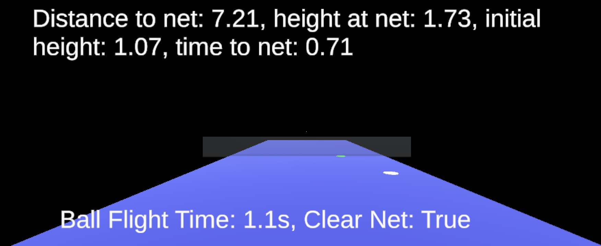

## Ball Trajectory
This application shows how in Unity it is possible to calculate a ball trajectory using a starting position and a target position, and a wanted time of flight.

Changing the any of those parameters will generate a different trajectory, which will always hit the target position if there are no obstacles.

It is also possible to determine if the ball will be able to clear the net that is in the middle of the court. It is more Tennis specific.

### Usage
To toggle the navigation between the ball and the target marker, press `space`.

Moving the ball or the target is done using the arrow keys. 

To control the ball's height position, use the `q` and `e` keys.

To control the time of flight, use the `+` and `-` keys.

Press `Enter` to launch the ball.

### Screenshots
Game view, the small dot in the center is the ball. The white circle on the floor is the target marker. The ball should land there.

A sample video of how the different parameters affect the flight of the ball.

